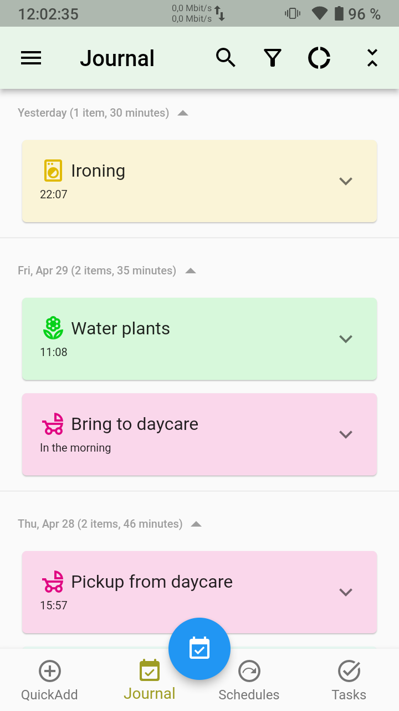
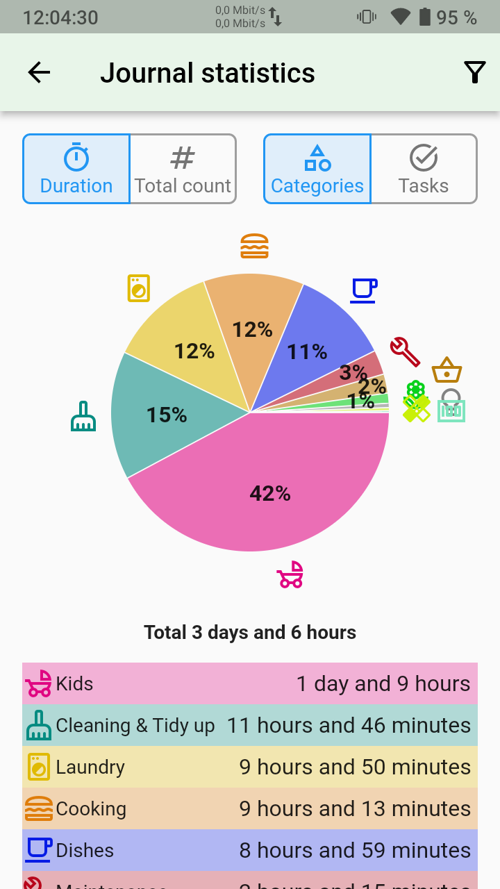
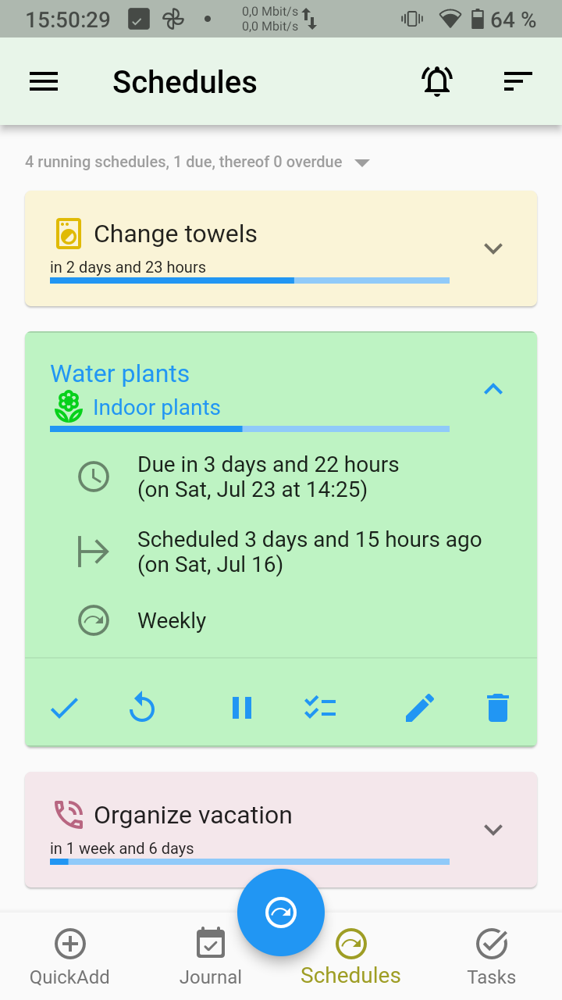
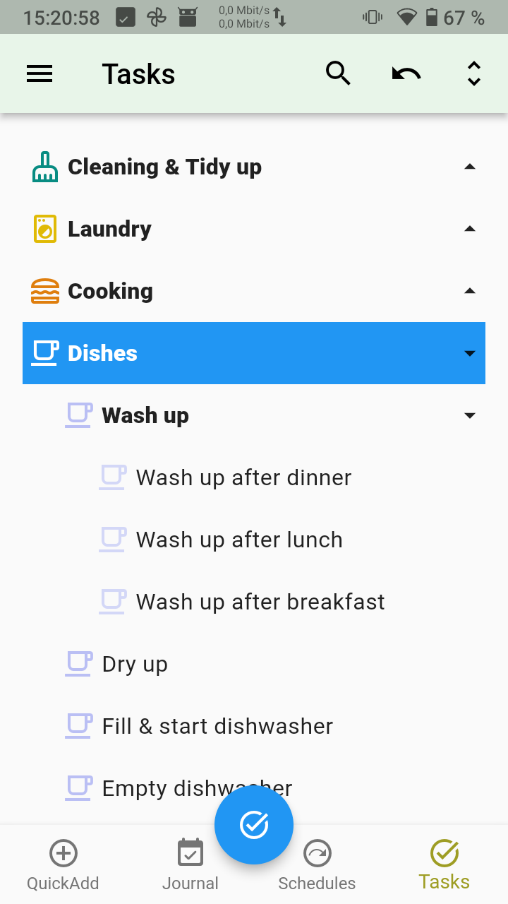
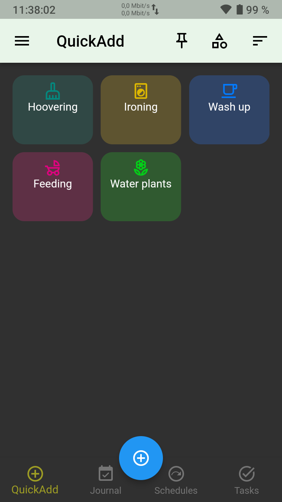
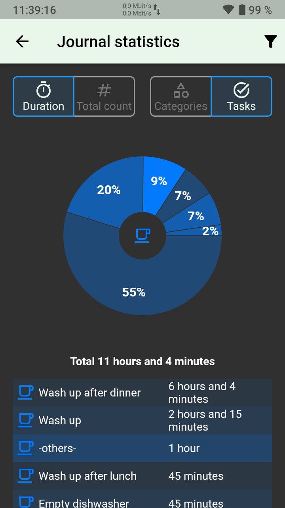
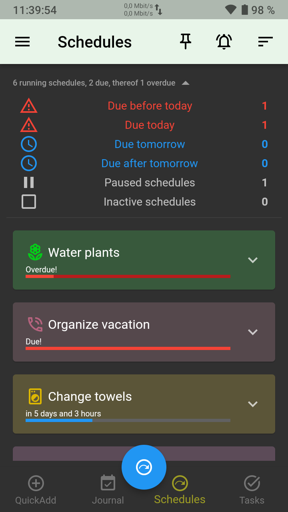

# Everyday Tasks

Track and log your tasks with EverydayTasks and create schedules for repetitive tasks. See how much time you have spent for certain tasks, and get notified if a scheduled task is due.

## Core features of the app

- log tasks you did fast and quickly
- track your tasks to the minute
- see statistics of your done tasks, e.g. how much time you spent on what
- create schedules for repetitive tasks with a custom interval and get notified when they are due 
- use dozens of predefined tasks and variants or create your own tasks 

For more information see [https://everydaytasks.jepfa.de](https://everydaytasks.jepfa.de)

## Screenshots

Show screenshots

Dark theme:

## Download

Otherwise, you can download the latest release version [here](https://everydaytasks.jepfa.de/download/).

## Development details

To re-generate floor files execute:

	flutter packages pub run build_runner build

To build the release with custom icon data:

    flutter build apk --release --no-tree-shake-icons

## Contribute
You are welcome to translate the app. See [TRANSLATE.md](TRANSLATE.md).
